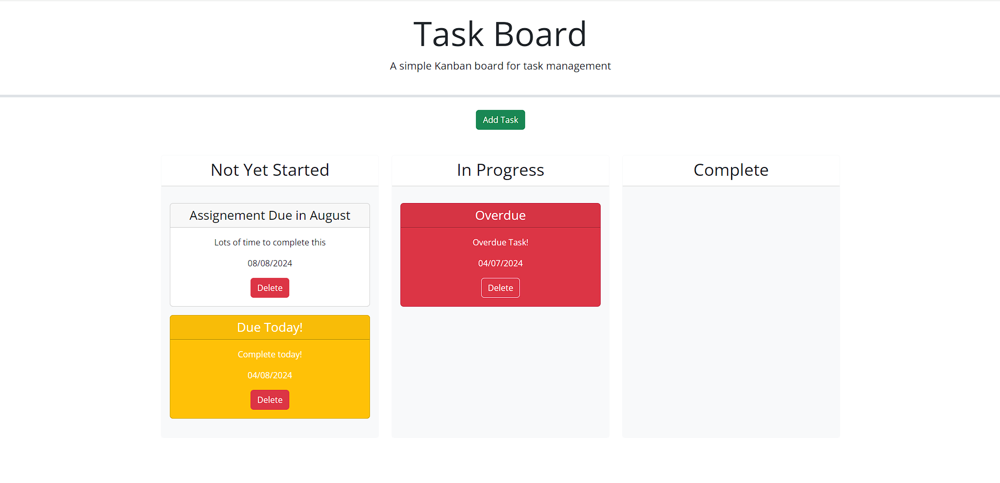
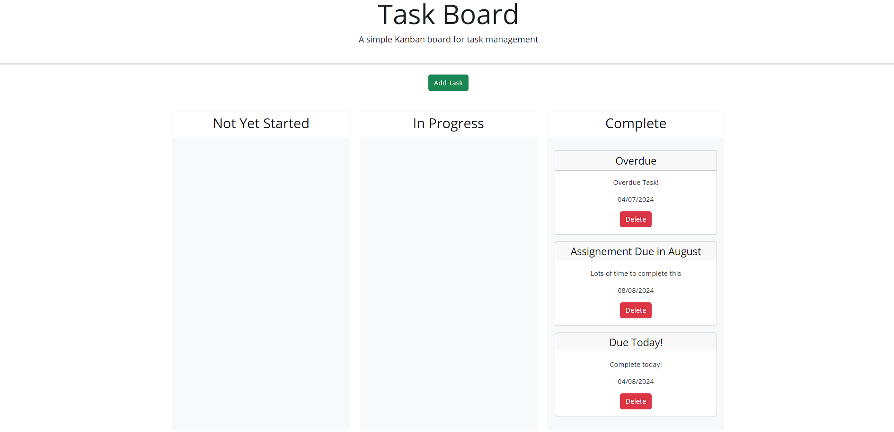
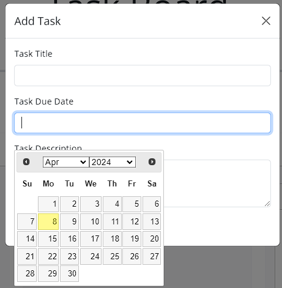

# Task Board Starter Code

## Descirption
This weeks challenge was to create a simple task board application that allows a team to manage project tasks by modifying starter code. This app runs in the browser and feature dynamically updated HTML and CSS powered by jQuery.

## User Story
AS A project team member with multiple tasks to organize
I WANT a task board 
SO THAT I can add individual project tasks, manage their state of progress and track overall project progress accordingly

## Acceptance Criteria
GIVEN a task board to manage a project
WHEN I open the task board
THEN the list of project tasks is displayed in columns representing the task progress state (Not Yet Started, In Progress, Completed)
WHEN I view the task board for the project
THEN each task is color coded to indicate whether it is nearing the deadline (yellow) or is overdue (red)
WHEN I click on the button to define a new task
THEN I can enter the title, description and deadline date for the new task into a modal dialog
WHEN I click the save button for that task
THEN the properties for that task are saved in localStorage
WHEN I drag a task to a different progress column
THEN the task's progress state is updated accordingly and will stay in the new column after refreshing
WHEN I click the delete button for a task
THEN the task is removed from the task board and will not be added back after refreshing
WHEN I refresh the page
THEN the saved tasks persist

## Installation 

There are no special requirements in order to install or run this program, please follow the hyperlink below to website page.

## Mock-Up

The following animation shows the web application's appearance and functionality and what I was looking to create.

Example 1: As you can see in this image this shows that dependent on the date, the boxes will change colour. If the item is due the same day ti will be yellow. If it is overdue it will be read and if it is still to be complete it will be white.

Example 2: This shows the functionality of the Kanban Board, once all the items are in the complete coloumn, the colour will change to white to show that it is no longer urgent or pending.

Example 3: This shows the functional date clicker as required in the acceptance criteria.

## Live Demo Link
https://kiranross1999.github.io/Kanban-Board/

## GitHub Link
https://github.com/KiranRoss1999/Professional-Portfolio

## Credits

MDN Web Docs - JavaScript by Mozilla
freeCodeCamp - Web Development by freeCodeCamp
Stack Overflow by Stack Exchange Inc.
CSS-Tricks - CSS by Chris Coyier
jQuery Learning Center by jQuery Foundation
Bootstrap Documentation by Bootstrap Team